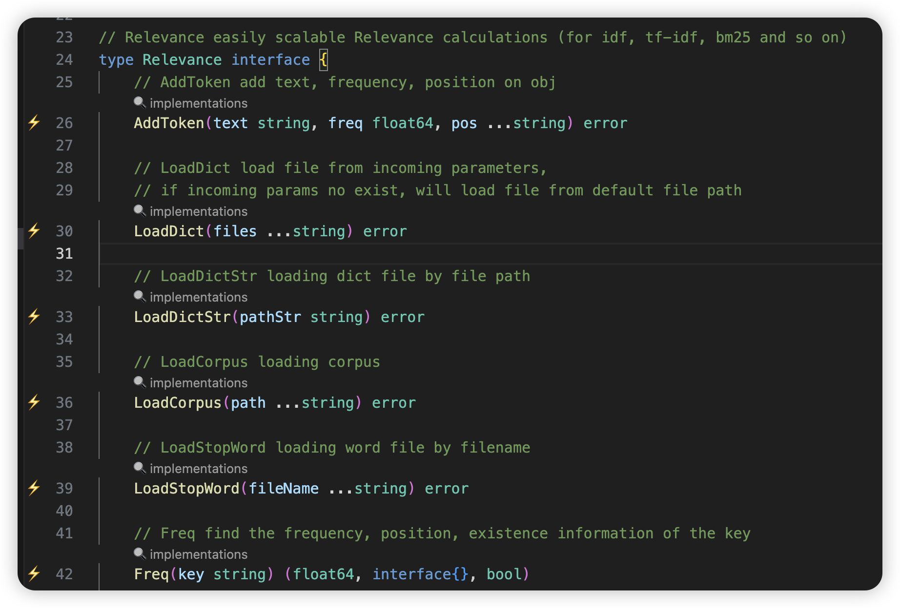
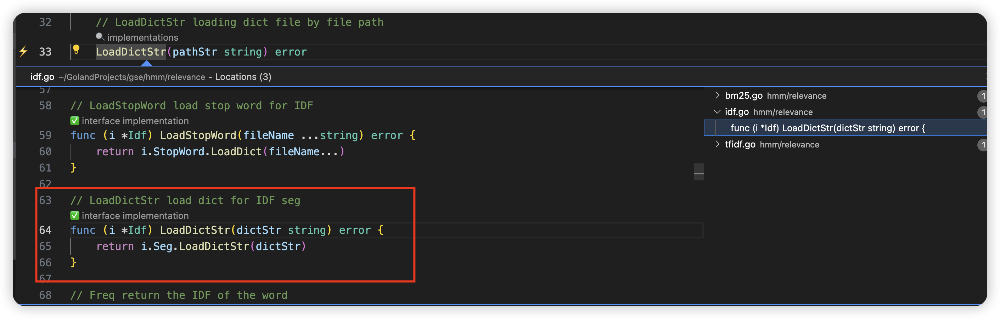
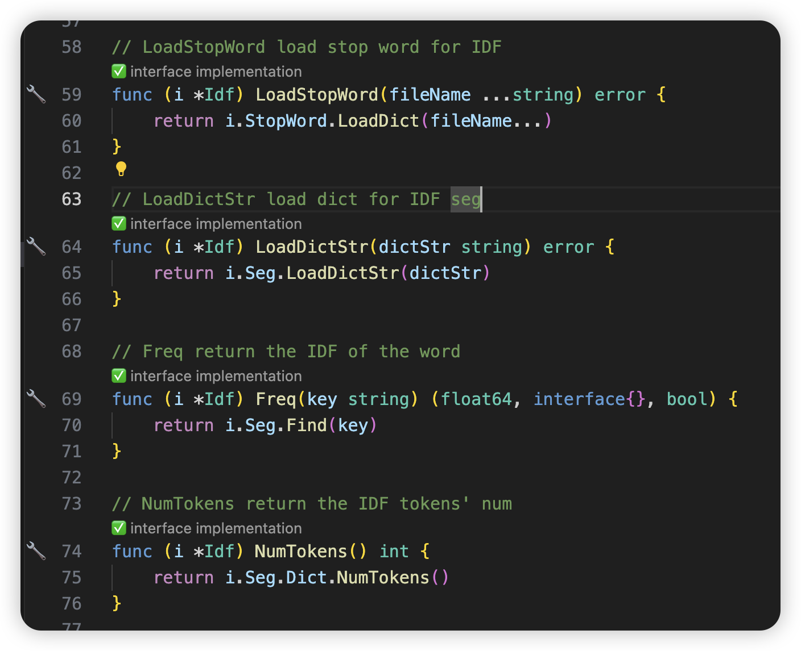
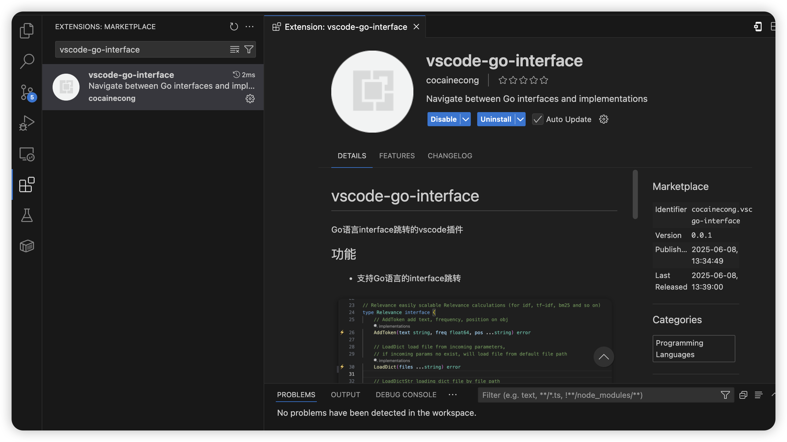

# vscode-go-interface 

Go语言interface跳转的vscode插件

## 功能

- 支持Go语言的interface跳转

- 支持Go语言的interface实现的函数跳转

## 待完善的点

- [ ] 点击位置不够精准
- [ ] 跳转后窗口无法自动关闭（待调研）
- [ ] interface 本身也需要跳转和返回，不仅仅是interface所定义的函数
- [ ] 代码重构，太慢了
- [ ] 英文版本

## 安装 & 使用

⚠️ **目前处于初始的试用版本，还不是正式版！**

vscode marketplace 搜索 `vscode-go-interface` 即可

